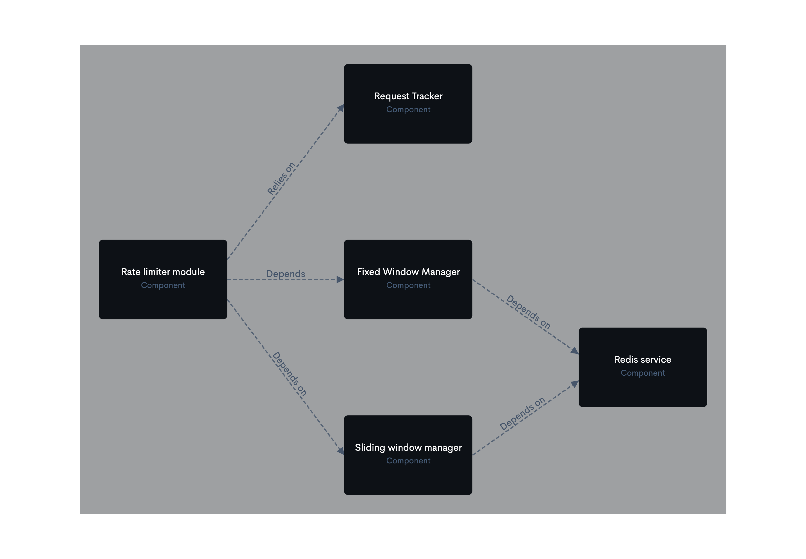

# XLimiter
is a simple rate limiter for NestJS. using [redis](https://www.npmjs.com/package/redis) packages.
## Description
in this package we have multiple Interceptors for rate limiting.
- `@SystemLimitInterceptor` for limiting requests per system capacity.
- `@MonthlyLimitInterceptor` for limiting requests monthly .
- `@DailyLimitInterceptor` for limiting requests daily .
## Installation
clone the repository and install dependencies.
```bash
$ yarn
```
## Spin up redis
```bash
$ docker build -t redis -f redis.dockerfile .
$ docker run -d -p 6379:6379 redis
```
## Spin up Nginx
```bash
$ docker build -t nginx -f nginx.dockerfile .
$ docker run -d -p 80:80 nginx
```

## Running the app

```bash
# development
$ yarn run start

# watch mode
$ yarn run start:dev

# production mode
$ yarn run start:prod
```

## Test The app

To access the app, navigate to the API gateway at http://localhost:80 and send a request to http://localhost:80/ with the api-key query parameter.

## Documentation
To access the documentation, navigate to http://localhost:80/docs

### Context


### Containers (Rate limit api)
%20-%20Container.png)

### Components (Rate limit api)



## Stay in touch
This readme is going to be updated soon.

## License
Nest is [MIT licensed](LICENSE).

## Appreciation
I appreciate [NestJS](https://nestjs.com/) team for their great framework and [redis](https://www.npmjs.com/package/redis) team for their great package.

